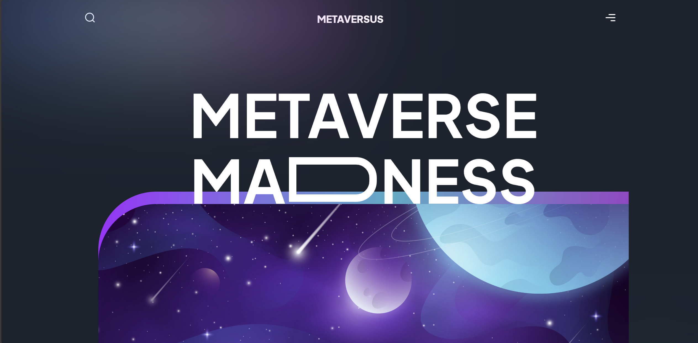
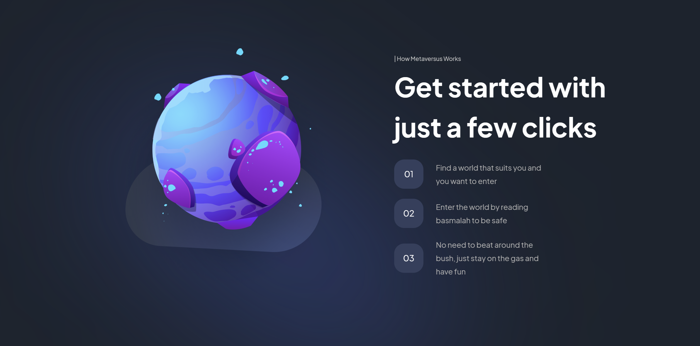

<div id="top"></div>


<div align="center">
  <h1 align="center">Metaversus</h1>
  <p>
    <b>Metaversus</b> is an immersive web project that focuses on stunning animations and design elements, 
    built with <b>React</b> and <b>Framer Motion</b>. 
    It aims to provide an engaging user experience through smooth and interactive animations,
    making use of modern frontend tools to bring the Metaverse to life on the web.
  </p>
</div>



# Features

- **React-based UI**: A responsive, dynamic user interface built with React.
- **Framer Motion Animations**: Fluid and interactive animations using the Framer Motion library.
- **Modern Web Design**: Sleek and innovative design focused on user experience.




## Getting Started

1. **Clone the repository**:
    ```bash
    git clone https://github.com/V3n0nX/Metaversus.git
    ```

2. **Navigate into the project folder**:
    ```bash
    cd metaversus
    ```

3. **Install the required dependencies**:
    ```bash
    npm install
    ```

4. **Run the development server**:
    ```bash
    npm run dev
    ```

5. Open your browser and visit `http://localhost:3000` to see the page in action!

---

You can start editing the page by modifying `pages/index.js`. The page auto-updates as you edit the file.

[API routes](https://nextjs.org/docs/api-routes/introduction) can be accessed on [http://localhost:3000/api/hello](http://localhost:3000/api/hello). This endpoint can be edited in `pages/api/hello.js`.

The `pages/api` directory is mapped to `/api/*`. Files in this directory are treated as [API routes](https://nextjs.org/docs/api-routes/introduction) instead of React pages.

This is a [Next.js](https://nextjs.org/) project bootstrapped with [`create-next-app`](https://github.com/vercel/next.js/tree/canary/packages/create-next-app).
